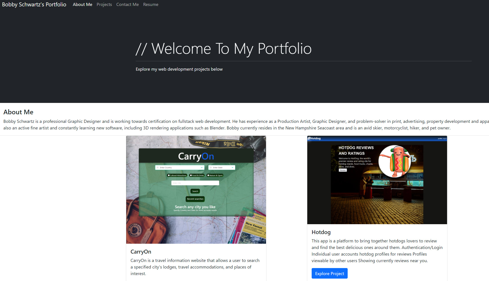

# My Portfolio

Deployed Site: https://robertschwartz603.github.io/BootCamp-Homework-Week2/

## Description
This is a deployed web application that showcases my various projects developed over the course of full-stack bootcamp.
this has been updated with with the help of Bootstrap!

## Table of Contents
- [Description](#description)
- [Usage](#usage)
- [License](#license)
- [Tests](#tests)
- [Questions](#questions)

## Usage
Use the navigation bar to navigate through different sections of my portfolio.

## License
This project and it's contents are licensed under: MIT

## Tests

## Questions

Github: https://github.com/robertschwartz603
Github Repo: https://github.com/robertschwartz603/BootCamp-Homework-Week2
